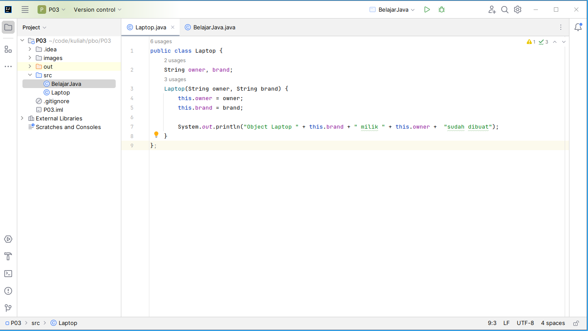

= Praktikum 3 - PBO
:source-highlighter: rouge
:author: Sri Aspari -- G.131.20.0045

[.text-center,.big]
*Sri Aspari -- G.131.20.0045*

== Screenshot

== Source Code

[,java]
----
// Laptop.java

include::src/Laptop.java[]
----

[source,java]
----
// BelajarJava.java

include::src/BelajarJava.java[]
----
