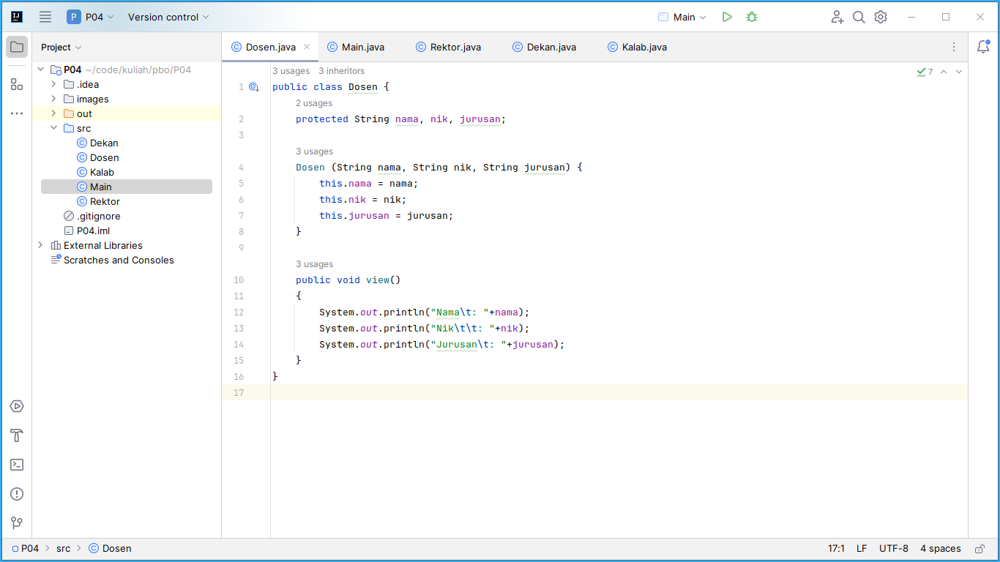
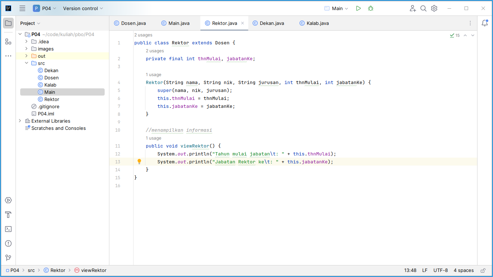
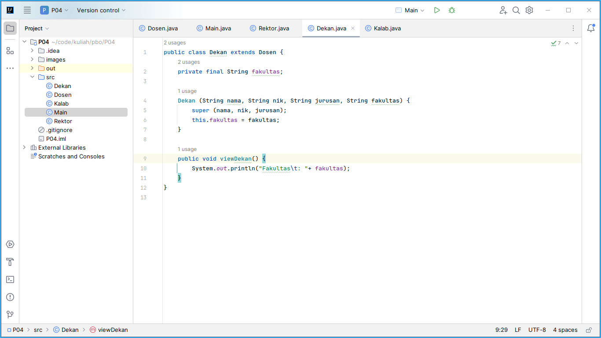
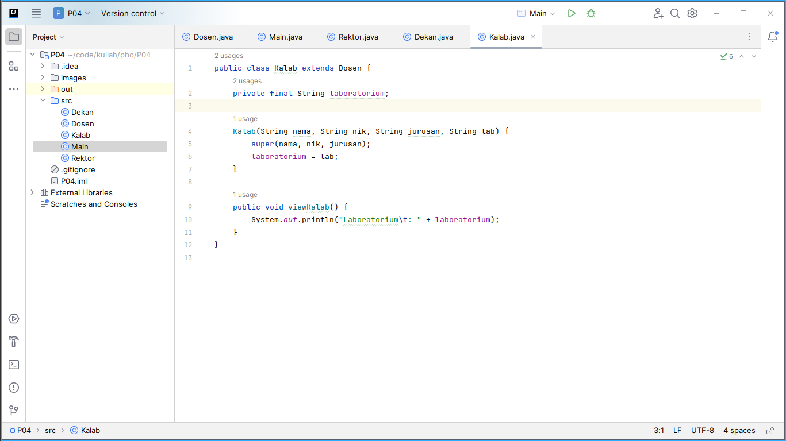
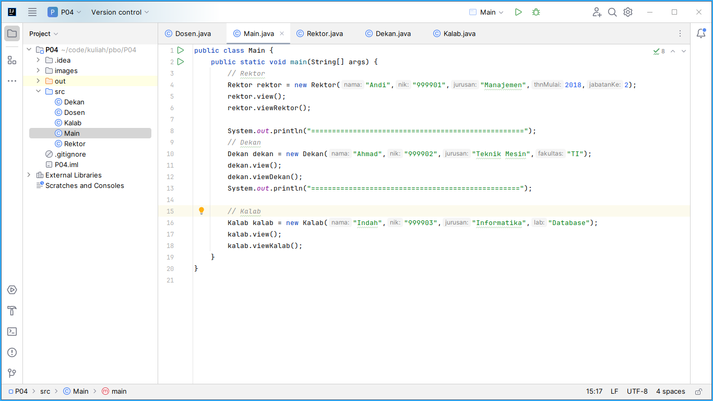
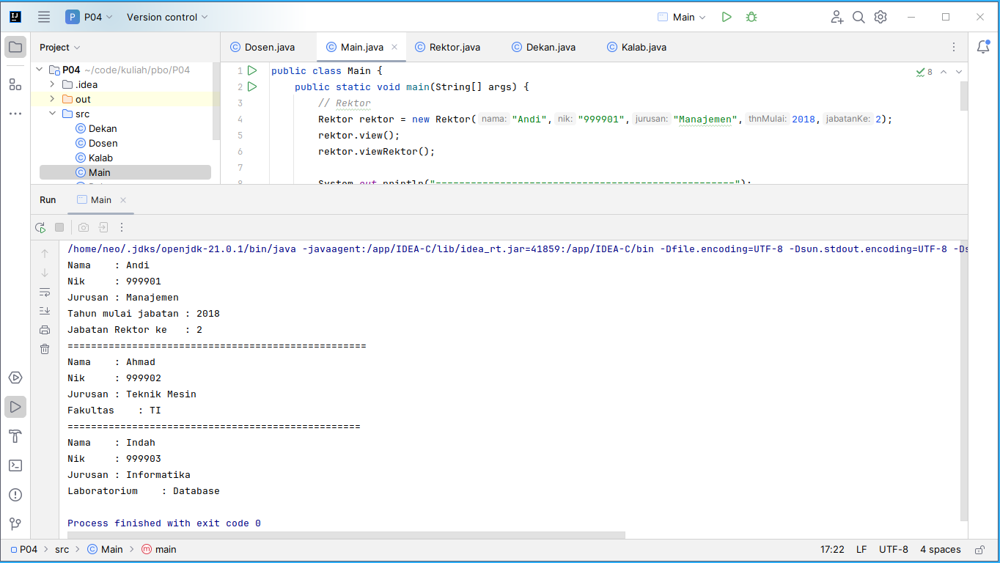

= Praktikum 4 - PBO
:doctype: article
:source-highlighter: rouge
:author: Sri Aspari -- G.131.20.0045

[.text-center]
*Sri Aspari -- G.131.20.0045*

== Screenshot

<<<

== Source Code

[,java]
----
// Dosen.java

include::src/Dosen.java[]
----

[source,java]
----
// Rektor.java

include::src/Rektor.java[]
----

[source,java]
----
// Dekan.java

include::src/Dekan.java[]
----

[source,java]
----
// Kalab.java

include::src/Kalab.java[]
----

[source,java]
----
// Main.java

include::src/Main.java[]
----